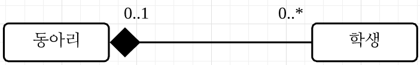

# 1. 객체지향 모델링

# 1.1. 모델링

* **모델의 역할**
  * 서로의 해석을 공유해 합의를 이루거나 해석의 타당성을 검토한다.
  * 현재 시스템 또는 앞으로 개발할 시스템의 원하는 모습을 가시화한다.
  * 시스템의 구조와 행위를 명세화할 수 있으며 시스템을 구축하는 틀을 제공한다.


모델은 **추상화(abstraction)** 에 바탕을 두고 만들어져야 한다.

**추상화** : 대상에 대한 특정 관점에서 관련이 있는 점을 부각시키고 관련이 없는 면은 무시하는 것

* **예시) 대학 학사 시스템 추상화**
  * **학생** 
    * 수강 과목, 지도 교수, 전공 (관련 있음)
    * 키, 몸무게 (관련 없음)


# 1.2. UML

**UML(Unified Modeling Language)** : 시스템을 모델로 표현해주는 언어 중에 대표적인 언어이다. 이것은 요구 분석, 시스템 설계, 시스템 구현 등의 시스템 개발 과정에서 개발자 사이의 의사소통이 원활하게 이루어지도록 <u>표준화한 통합 모델링 언어이다.</u>


# 1.3. 클래스 다이어그램

**클래스 다이어그램** : 시스템을 구성하는 클래스 사이의 관계를 표현한다. 주요 구성 요소는 클래스와 관계다.


## 1.3.1. 클래스

**클래스란** 동일한 속성과 행위를 수행하는 객체의 집합이다. 그리고 객체를 생성하는 설계도로 간주할 수 있다.

* **Ex)** 학생 클래스는 이름, 전공, 학번, 수강 과목이라는 **공통적인 데이터를(속성)** 가지며 **과목을 수강할(행위)** 책임이 있다.

  

**UML 클래스 표현 예**


* **가장 윗부분** : 클래스 이름 (학생)

* **중간 부분** : 클래스의 특징을 나타내는 속성 (이름, 전공, …)

* **마지막 부분** : 클래스가 수행하는 책임, 즉 연산들 (수강하다)

* **속성과 연산들의 접근 제어자 표현** : 위의 예시에서 속성과 연산을 보면 '-', '+' 와 같은 부호를 사용한다.

  | 접근 제어자 | 표시 | 설명                                                         |
  | ----------- | ---- | ------------------------------------------------------------ |
  | public      | +    | 어떤 클래스의 객체에서든 접근 가능                           |
  | private     | -    | 이 클래스에서 생성된 객체들만 접근 가능                      |
  | protected   | #    | 이 클래스와 동일 패키지에 있거나 상속 관계에 있는 하위 클래스의 객체들만 접근 가능 |
  | package     | ~    | 동일 패키지에 있는 클래스의 객체들만 접근 가능               |


**속성과 연산 UML 표기법** : '[ ]' 부분은 생략 가능

| 분류 | 표기 방법                                                    |
| ---- | ------------------------------------------------------------ |
| 속성 | [+\|-\|#\|~] 이름: 타임 [다중성 정보] [=초기값]              |
| 연산 | [+\|-\|#\|~] 이름 (인자1: 타입1, …, 인자n: 타입n): 반환 타입 |

* **예시)**

  

  ```java
  public class Course {
    private String id;
    private String name;
    private int numOfStudents = 0;
    
    public void addStudent(){};
    public void deleteStudent(){};
  }
  ```


## 1.3.2. 관계

객체지향 시스템은 여러 개의 클래스가 서로 긴밀한 관계를 맺어 기능을 수행한다.

* **관계**

| 관계                                 | 설명                                                         |
| ------------------------------------ | ------------------------------------------------------------ |
| 연관 관계 (association)              | 한 클래스가 다른 클래스에서 제공하는 기능을 사용하는 관계. 실선이나 화살표로 표시한다. |
| 일반화 관계 (generalization)         | 상속 관계. 속이 빈 화살표를 사용해 표시한다.                 |
| 집합 관계 (composition, aggregation) | 클래스들 사이의 전체 또는 부분 같은 관계. 마름모를 사용해 표시한다. |
| 의존 관계 (dependency)               | 한 클래스가 다른 클래스에서 제공하는 기능을 사용할 때나 한 메서드를 실행하는 동안의 매우 짧은 시간만 유지되는 관계. 점선 화살표를 사용해 표시한다. |
| 실체화 관계 (realization)            | 인터페이스를 구현한 클래스들 사이의 관계를 나타낸다. 상속과 유사하게 빈 삼각형을 사용하며 머리에 있는 실선 대신 점선을 사용해 표시한다. |


### 연관 관계

* **Professor 클래스와 Student 클래스의 연관 관계**

  

  > 연관 관계를 가지면 각 클래스의 객체는 해당 연관 관계에서 어떤 역할을 수행하게 된다. 이러한 역할은 클래스 바로 옆 선 가까이에 적을 수 있다.

  

  

  > 위의 연관 관계는 **양방향(bidirectional) 연관 관계다.** 두 클래스의 객체들이 서로의 존재를 인식한다는 의미이다.

* **예제) 사람과 전화기의 관계**

  

  ```java
  public class Person {
    private Phone[] phones;
    
    public Person() {
      phones = new Phone[2];
    }
  }
  ```

* **예제) 사람과 전화기의 관계2**

  

  ```java
  public class Person {
    private Phone homePhone;
    private Phone officePhone;
    
    public void setHomePhone(Phone phone) {
      this.homePhone = phone;
    }
    
    public void setOfficePhone(Phone phone) {
      ths.officePhone = phone;
    }
  }
  ```

  

* **다중성(multiplicity)** 

  : 연관된 객체 수를 연관된 클래스와 연결한 선 부근에 명시하는 것. 선에 아무런 숫자가 없으면 일대일 관계임을 나타낸다.

| 다중성 표기 | 의미                   |
| ----------- | ---------------------- |
| 1           | 엄밀하게 1             |
| *           | 0 또는 그 이상         |
| 0..*        | 0 또는 그 이상         |
| 1..*        | 1 이상                 |
| 0..1        | 0 또는 1               |
| 2..5        | 2 또는 3 또는 4 또는 5 |
| 1, 2, 6     | 1 또는 2 또는 6        |
| 1, 3..5     | 1 또는 3 또는 4 또는 5 |

* **예제) 한 교수에 여러 학생이 연관되는 다중성의 예**


* **단방향 연관 관계**

: 한 클래스로만 방향성이 있는 연관 관계


**Student 클래스**

```java
import java.util.Vector;

public class Student {

  private String name;
  private Vector<Course> courses;

  public Student(String name) {
    this.name = name;
    courses = new Vector<>();
  }

  public void registerCourse(Course course) {
    courses.add(course);
  }

  public void dropCourse(Course course) {
    if (courses.contains(course)) {
      courses.remove(course);
    }
  }
  
  public Vector<Course> getCourses() {
    return courses;
  }

}
```

**Course 클래스**

```java
package object_oriented_modeling;

public class Course {

  private String name;

  public Course(String name) {
    this.name = name;
  }

  public String getName() {
    return name;
  }

}
```


* **다대다 연관 관계**

: 다대다 연관 관계(양방향 연관 관계)는 서로의 존재를 안다는 의미이다. 그에 반해 단방향 연관 관계는 한 쪽은 알지만 다른 쪽은 상대방의 존재를 모른다는 의미이다.


**Student 클래스**

```java
import java.util.Vector;

public class Student {

  private String name;
  private Vector<Course> courses;

  public Student(String name) {
    this.name = name;
    courses = new Vector<>();
  }

  public void registerCourse(Course course) {
    courses.add(course);
    course.addStudent(this);
  }

  public void dropCourse(Course course) {
    if (courses.contains(course)) {
      courses.remove(course);
      course.removeStudent(this);
    }
  }

  public Vector<Course> getCourses() {
    return courses;
  }

}
```

**Course 클래스**

```java
import java.util.Vector;

public class Course {

  private String name;
  private Vector<Student> students;

  public Course(String name) {
    this.name = name;
    students = new Vector<>();
  }

  public void addStudent(Student transcipt) {
    students.add(transcipt);
  }

  public void removeStudent(Student transcipt) {
    students.remove(transcipt);
  }

  public Vector<Student> getStudents() {
    return students;
  }

  public String getName() {
    return name;
  }

}
```


* **연관 클래스** 

  : 연관 관계에 **추가할 속성이나 행위가 있을 때 사용한다.** 예를 들어, 학생 클래스와 과목 클래스가 있을 때 성적은 두 클래스가 존재해야만 의미 있는 정보가 되기 때문에, 성적 정보는 클래스의 속성이 아닌 '수강하다' 라는 연관 관계의 속성으로 다뤄야 한다. 이런 경우 연관 클래스를 사용하면 된다.

  

  * **연관 클래스를 일반 클래스로 변환한 예**

  

  **Student 클래스**

  ```java
  import java.util.Vector;
  
public class Student {
  
  private String name;
    private Vector<Transcript> transcripts;

    public Student(String name) {
    this.name = name;
      transcripts = new Vector<>();
  }
  
  public void addTranscript(Transcript transcript) {
      transcripts.add(transcript);
    }
  
    public Vector<Transcript> getTranscripts() {
      return transcripts;
    }
  
    public String getName() {
      return name;
    }
  
  }
  ```
  
  **Course 클래스**
  
  ```java
  import java.util.Vector;
  
  public class Course {
  
    private String name;
    private Vector<Transcript> transcripts;
  
    public Course(String name) {
      this.name = name;
      transcripts = new Vector<>();
    }
  
    public void addTranscript(Transcript transcript) {
      transcripts.add(transcript);
    }
  
    public Vector<Transcript> getTranscripts() {
      return transcripts;
    }
  
    public String getName() {
      return name;
    }
  
  }
  ```
  
  **Transcript 클래스**
  
  ```java
  public class Transcript {
  
    private Student student;
    private Course course;
    private String date;
    private String grade;
  
    public Transcript(Student student, Course course) {
      this.student = student;
      this.student.addTranscript(this);
      this.course = course;
      this.course.addTranscript(this);
    }
  
    public Student getStudent() {
      return student;
    }
  
    public Course getCourse() {
      return course;
    }
  
    public void setDate(String date) {
      this.date = date;
    }
  
    public String getDate() {
      return date;
    }
  
  
    public String getGrade() {
      return grade;
    }
  
    public void setGrade(String grade) {
      this.grade = grade;
    }
    
  }
  ```
  
  > Student 클래스와 Transcipt 클래스의 연관 관계도 일대다 다중성을 갖으며 Course 클래스와 Transcipt 클래스 또한 그렇다.
  
  * **이력** : 어떤 연관 관계의 내용
  
    * **예시) 학생의 도서관 대출 이력**
  
      


* **연관 관계는 때로는 재귀적(reflexive)일 수 있다.**

  * **재귀적 연관 관계** : 동일한 클래스에 속한 객체들 사이의 관계이다.

  * **예시) 직원과 관리자 역할**

    

    > 하지만 여기서 사원과 사원이 서로 관리를 하는 모순이 발생할 수 있다. 이러한 관계를 재귀적 연관 관계라 한다.

    

    ​							 

    > 이를 '관계의 루프'라고 하는데, 이런 상황을 배제하려면 연관 관계에 제약을 설정해야 한다.

    

    

    > 제약은 '{ }' 안에 미리 정해진 제약뿐만 아니라 어떤 문장도 자유롭게 쓸 수 있으며 클래스나 연관 관계를 포함한 UML 모델 요소가 따라야 하는 규칙을 붙여줄 때 사용한다. 
    >
    > **'{계층}'** : 객체 사이에 상하 관계가 존재하고 사이클이 존재 하지 않는다는 의미다.


### 일반화 관계

한 클래스가 다른 클래스를 포함하는 상위 개념일 때 두 클래스 사이에는 일반화 관계가 존재한다.

* **일반화 관계(상속 관계)** : 자식 클래스가 부모 클래스로부터 속성과 연산을 물려받는 관계이다.

  * **ex) 가전 제품(부모) - 세탁기, TV, 식기세척기(자식) <= 일반화 관계**

  

  * 이때 부모 클래스인 가전 제품 클래스는 구현되지 않은 메소드인 추상 메소드를 가지고 있다. 
  * 이와 같이 추상 메소드를 하나 이상 가지는 클래스를 **추상 클래스** 라고 , UML에서는 추상 클래스와 메서드를 이탤릭체로 써서 구분하거나 스테레오 타입('<<', '>>' 기호 안에 원하는 이름을 넣음)으로 표시한다.
    * **이탤릭체** : *이탤릭체*
    * **스테레오 타입** : *<\<interface>>*


* **예제) 일반화 관계**

  

  * **HomeAppliancies 클래스**

    ```java
    package object_oriented_modeling;
    
    public abstract class HomeAppliancies {
    
      private int serialNo;         // 제조 번호
      private String manufacturer;  // 제조 회사
      private int year;             // 제조 년도
    
      public abstract void turnOn();
      public abstract void turnOff();
    
    }
    ```

  * **Washer 클래스**

    ```java
    package object_oriented_modeling;
    
    public class Washer extends HomeAppliancies {
    
      @Override
      public void turnOn() {
        // ...
      }
    
      @Override
      public void turnOff() {
        // ...
      }
    }
    ```

    > 나머지 Freezer, DishWasher 클래스도 비슷하게 구현하면 된다.


### 집합 관계

: UML 연관 관계의 특별 경우로 **전체와 부분의 관계를** 명확하게 명시하고자 할 때 사용한다. **집약(aggregation)과 합성(composition)** 두 종류의 집합 관계가 존재한다.

* **집약 관계** : 한 객체가 다른 객체를 포함하는 것을 나타낸다.

  * 전체 객체와 부분 객체의 생명 주기가 다르다.
  * 부분 객체를 여러 전체 객체가 공유할 수 있다.

  

* **합성 관계** : 전체를 가리키는 클래스 방향에 채워진 마름모로 표시되며 부분 객체가 전체 객체에 속하는 관계다.

  * 전체 객체가 없어지면 부분 객체도 없어진다.
  * 부분 객체를 여러 전체 객체가 공유할 수 없다.

  

* **예제) 합성 관계**

  

  ```java
  public class Computer {
    
    private MainBoard mb;
    private CPU c;
    private Memory m;
    private PowerSupply ps;
    
    public Computer() {
      this.mb = new MainBoard();
      this.c = new CPU();
      this.m = new Memory();
      this.ps = new PowerSupply();
    }
    
  }
  ```

  > Computer 객체를 생성하면 MainBoard, CPU, Memory, PowerSupply 객체가 생성된다. 이러한 부품 객체들은 Computer 객체가 사라지면 같이 사라진다. 즉, **부품 객체들의 라이프타임이 Computer 객체의 라이프타임에 의존하는 관계가 형성된다.**


* **예제) 집약 관계**

  

  ```java
  public class Computer {
    
    private MainBoard mb;
    private CPU c;
    private Memory m;
    private PowerSupply ps;
    
    public Computer(MainBoard mb, CPU c, Memory m, PowerSupply ps) {
      this.mb = mb;
      this.c = c;
      this.m = m;
      this.ps = ps;
    }
    
  }
  ```

  > 집약 관계는 합성 관계와 다르게 Computer 객체가 사라져도 부품 객체들은 삭제되지 않는다. 왜냐하면, 부품 객체들은 외부에서 **이들 객체에 대한 참조만 받아 사용했기 때문이다.**

  

* **연습 문제) 동아리와 학생의 관계에서 다음 사실을 모두 클래스 다이어그램으로 표현하라.**

  1. 학생은 한 동아리에만 가입할 수 있다.
  2. 한 동아리에는 여러 명의 학생들이 있다.
  3. 동아리가 없어지면 동아리에서 활동했던 학생들의 정보도 없어진다.

  


### 의존 관계

: 짧은 시간 동안 이용하는 관계이다.

* **예시) 연관 관계와 의존 관계 (자동차, 사람, 주유)**

  * 자동차(Car 클래스)를 소유한 사람(Person 클래스)이 있을 경우에, 그 사람은 오랜 기간동안 그 자동차를 이용할 것이다. 이런 경우 사람과 자동차의 **관계는 오랫동안 유지되므로 연관 관계이다.**

  

  * 자동차에 주유할 때는 매번 똑같은 곳에서만 주유를 하지 않는다. 즉, 주유기가 매번 달라지므로 객체지향 프로그램에서는 사용되는 주유기를 인자나 지역 객체로 생성해 구현한다. 이러한 **짧은 시간 동안 유지되는 관계를 의존 관계라 한다.**

    


### 인터페이스와 실체화 관계

* **인터페이스** : 책임(responsibility)이다. 
  * 책임이란 **객체가 해야 하는 일로서** 해석할 수 있고 **객체가 할 수 있는 일로도** 해석할 수 있다. 
  * 즉, 객체가 외부에 제공하는 서비스나 기능을 객체가 **수행하는 책임으로 본다.**
  * 인터페이스 자체는 실제로 책임을 수행하는 객체가 아니다.
  * 스테레오 타입인 '<< >>' 에 interface 라는 키워드를 넣고, 그 밑에 이탤릭체로 인터페이스 실체화 관계를 적는다.

* **예시) 비행기와 새의 능력**

  

  > 비행기와 새는 공통적으로 날 수 있는 능력이 있다. 이런 **공통 능력이라는 관점에서** 비행기와 새를 그룹화할 수 있는 메커니즘이 바로 **인터페이스다.**

  **다른 방식의 표현**

  

  > 인터페이스를 작은 원으로 그린 후 클래스와 인터페이스를 실선으로 연결했다.

  

  